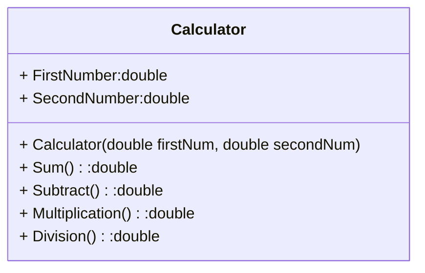
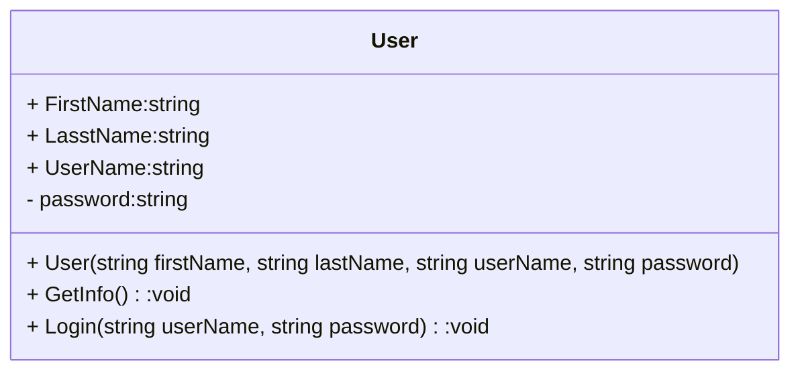
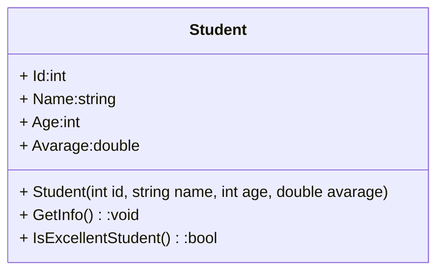
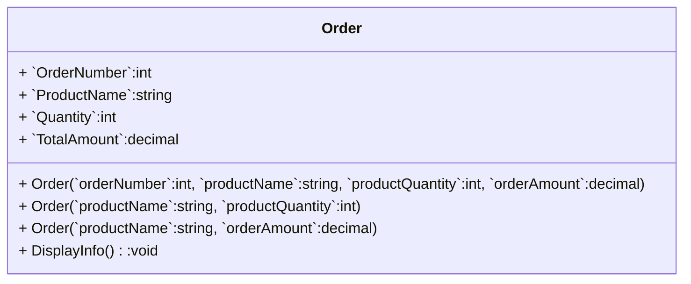

### Task 1:Calculator

Write a program in C# that asks the user for two numbers and one operation (`+`, `-`, `*`, `/`). It will then calculate the operation and display the result on the screen.

1. Create a public class `Calculator`.
2. Create a constructor that initializes the first number and the second number: `Calculator(int num1, int num2)`.
3. Create an infinite loop in the `Program.cs`.
4. Create the following methods in the `Calculator` class:      
    * `Sum()`    
    * `Subtract()`            
    * `Multiplication()`           
    * `Division()`           
6. Use a `switch` block inside `Program.cs` to call the appropriate methods based on the chosen operation.

##

Напишите программу на C#, которая запрашивает у пользователя два числа и одну операцию (`+`, `-`, `*`, `/`).  
Затем она выполнит указанную операцию и отобразит результат на экране. 

### Инструкции

1. Создайте общедоступный класс `Calculator`.

2. Создайте конструктор, который инициализирует первое число и второе число: `Calculator(firstNum, secondNum)`.

3. Создайте бесконечный цикл в классе `Program`.

4. Создайте следующие методы в классе `Calculator`:      
    * `Sum()` (Сложение)           
    * `Subtract()` (Вычитание)            
    * `Multiplication()` (Умножение)          
    * `Division()` (Деление)     

6. Используйте блок `switch` внутри файла `Program.cs`, чтобы вызывать соответствующие методы на основе выбранной операции.

##

Дар C# барномае нависед, ки аз корбар ду адад ва як амалро талаб кунад (`+`, `-`, `*`, `/`). Баъдан амалиётро ҳисоб мекунад ва натиҷаро дар экран нишон медиҳад.

1. Public класси `Calculator` созед.
2. Конструкторе созед, ки адади якум ва дуюмро кимат медихад: `Calculator(int num1, int num2)`.
3. Дар `Program.cs' цикл беохир созед.
4. Усулҳои зеринро дар синфи `Calculator` созед:
    * `Sum()` (Чамъ)           
    * `Subtract()` (Тарҳ)         
    * `Multiplication()` (Зарб)          
    * `Division()` (Тақсим)
6. Барои истифодаи усулҳои мувофиқ дар асоси амалиёти интихобшуда, блоки `switch`-ро дар дохили `Program.cs` истифода баред.



---

### Task 2: Access Control 

Write an access control program in C# that asks the user for a username and password. Both must be entered by the user.

1. Create a public class `User` with the following properties and fields:
   - `FirstName` : string
   - `LastName` : string
   - `UserName` : string
   - `password` : string
   
2. Create the following methods in the `User` class:
   - `GetInfo()`
   - `Login()`
   
3. Create an array of `User` objects and populate it with 5 users.

4. Implement an infinite loop that prompts the user to enter a `username` and `password` from the console.

5. Check if the entered username and password match any user in the array.

6. If the username and password are correct, display the message: `"Login successful! Welcome, Mr./Ms. {FirstName} {LastName}"`.

7. If the username and password are incorrect, display the message: `"Login failed!"`.

##

Напишите программу контроля доступа на C#, которая запрашивает у пользователя имя пользователя и пароль. Оба должны быть введены пользователем.

1. Создайте общедоступный класс User со следующими свойствами и полями:
    - `FirstName` : string
    - `LastName` : string
    - `UserName` : string
    - `password` : string
   
2. Создайте в классе `User` следующие методы:
    - `GetInfo()`
    - `Login()`

3. Создайте массив объектов `User` и заполните его пятью пользователями.

4. Реализуйте бесконечный цикл, предлагающий пользователю ввести имя `userName` и `password` с консоли.

5. Проверьте, совпадают ли введенные имя пользователя и пароль с каким-либо пользователем в массиве.

6. Если имя пользователя и пароль верны, отобразите сообщение: `"Login successful! Welcome, Mr./Ms. {FirstName} {LastName}"`.

7. Если имя пользователя и пароль неверны, отобразится сообщение: `Login failed!`.



---

### Task 3:

Write a class called `Student` that represents a student with a name, age, and average grade.


1. Create a public class called `Student` with the following properties:.
    - `Id` (type: int)
    - `Name` (type: string)
    - `Age` (type: int)
    - `Avarage` (type: double)
2. Create a constructor that takes parameters `id`, `name`, `age`, and `averageGrade` to initialize the object's properties.

3. Add a method called `GetInfo()` that will display information about the student in the format of a string,       
    
    for example: `"Id=1; Name: Shahrom, Age: 20, Average Grade: 4.5"`.    

5. Add a method called `IsExcellentStudent()` that will return `true` if the student's average grade is above 4.0, and `false` otherwise.  This method will help determine if the student is an excellent student.

##

Напишите класс "Student", который будет представлять студента с именем, возрастом и средней оценкой по предметам.

1. Создайте публичный класс `Student` с такими свойствами.
    - `Id` (type: int)
    - `Name` (type: string)
    - `Age` (type: int)
    - `Avarage` (type: double)

3. Создайте конструктор, который принимает параметры `id`, `name`, `age` и `averageGrade` для инициализации свойств объекта.

4. Добавьте метод `GetInfo()`, который будет выводить информацию о студенте в формате строки,                                
    например: `"Id=1; Name: Shahrom, Age: 20, Average Grade: 4.5"`.         
5. Добавьте метод `IsExcellentStudent()`, который будет возвращать `true`, если средняя оценка студента     
   выше 4.0, и `false` в противном случае. Этот метод поможет определить, является ли студент отличником.

##

Классеро бо номи "Student" нависед, ки донишҷӯро бо ном, синну сол ва баҳои миёна муаррифӣ мекунад.


1. Класси оммавӣ бо номи `Student` бо хосиятҳои зерин эҷод кунед:.
    - `Id` (type: int)
    - `Name` (type: string)
    - `Age` (type: int)
    - `Avarage` (type: double)
2. Конструктор созед, ки барои киммат додани хосиятҳои объект параметрҳои `id`, `name`, `age` ва `averageGrade`-ро мегирад.

3. Усули бо номи `GetInfo()` илова кунед, ки маълумотро дар бораи донишҷӯ дар формати сатр намоиш медиҳад, масалан: `"Id=1; Name: Shahrom, Age: 20, Average Grade: 4.5"`.

5. Усули бо номи "IsExcellentStudent()" илова кунед, ки агар баҳои миёнаи донишҷӯ аз 4.0 боло бошад, `true` ва дар акси ҳол `false`-ро баргардонад. Ин усул барои муайян кардани он, ки донишҷӯ донишҷӯи аъло аст ё не.


---

### Task 4

You need to create a simple order accounting system for an online store using constructors in the C# programming language.

Program requirements:

1. Create a class `Order` with properties:
     - `OrderNumber`:int
    - `ProductName`:string
    - `Quantity`:int
    - `TotalAmount`:decimal
2. Implement several constructors for the `Order` class with different sets of parameters:
  - A constructor that accepts all four fields (`orderNumber`:int, `productName`:string, `productQuantity`:int, `orderAmount`:decimal).
  - A constructor that accepts only the `productName`:string and `productQuantity`:int (the remaining fields are set by default).
  - A constructor that accepts only the `productName`:string and `orderAmount`:decimal (the remaining fields are set by default).
3. Create a `DisplayInfo()` method that displays order information to the console.

4. In the `Main` function, create several objects of the `Order` class using various constructors, and display information about orders to the console using the `DisplayInfo()` method.

##

Вам нужно создать простую систему учета заказов для интернет-магазина с использованием конструкторов в языке программирования C#.

Требования к программе:

1. Создайте класс `Order` с свойствами:
    - `OrderNumber`:int
    - `ProductName`:string
    - `Quantity`:int
    - `TotalAmount`:decimal
2. Реализуйте несколько конструкторов для класса `Order` с различными наборами параметров:
    - Конструктор, принимающий все четыре поля (`orderNumber`:int, `productName`:string, `productQuantity`:int, `orderAmount`:decimal).
    - Конструктор, принимающий только `productName`:string и `productQuantity`:int (остальные поля устанавливаются по умолчанию).
    - Конструктор, принимающий только `productName`:string и `orderAmount`:decimal (остальные поля устанавливаются по умолчанию).
3. Создайте метод `DisplayInfo()`, который выводит информацию о заказе на консоль.

4. В функции `Main` создайте несколько объектов класса `Order`, используя различные конструкторы, и выведите информацию о заказах на консоль с помощью метода `DisplayInfo()`.

## 

Шумо бояд системаи оддии баҳисобгирии фармоишро барои мағозаи онлайн бо истифода аз конструкторҳо дар забони барномасозии C # эҷод кунед.

Талаботи барнома:

1. Класси `Order` бо хосиятхои зерин созед:
    - `OrderNumber`:int
    - `ProductName`:string
    - `Quantity`:int
    - `TotalAmount`:decimal
2. Якчанд конструкторҳоро барои синфи 'Order' бо маҷмӯи параметрҳои гуногун амалӣ кунед:
   - Конструкторе, ки ҳамаи чаҳор майдонро қабул мекунад (`orderNumber`:int, `mahsulName`:string, `productQuantity`:int, `orderAmount`:decimal).
   - Конструкторе, ки танҳо `productName`:string ва `productQuantity`:int-ро қабул мекунад (майдонҳои боқимонда ба таври пешфарз муқаррар карда мешаванд).
   - Созандаи, ки танҳо `mahsul`:string ва `orderAmount`:decimal қабул мекунад (майдонҳои боқимонда ба таври пешфарз муқаррар карда мешаванд).
3. Усули `DisplayInfo()` созед, ки маълумоти фармоишро ба консол намоиш медиҳад.

4. Дар функсияи `Main` бо истифода аз конструкторҳои гуногун якчанд объекти синфи `Order` эҷод кунед ва маълумотро дар бораи фармоишҳо ба консол бо истифода аз усули `DisplayInfo()` намоиш диҳед.



```csharp
// Создание объектов с использованием различных конструкторов
Order order1 = new Order(101, "Ноутбук", 2, 2500.0);
Order order2 = new Order("Смартфон", 5);
Order order3 = new Order("Наушники", 120.5);

// Вывод информации о заказах
Console.WriteLine("Информация о заказах:");
order1.DisplayInfo();
order2.DisplayInfo();
order3.DisplayInfo();
```
